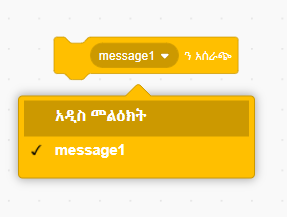
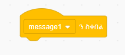
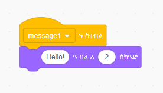

ስርጭት ማለት በአንድ ስፕራይት የተላከ መልክት ሆኖ ነገር ግን በሁሉም ስፐራይቶች ሊሰማ ይሚችል መልክት መላክ ማለት ነው. በድምጽ ማጉያ ላይ እንደተነገረ መልክት አድርገው አስቡት.

### ስርጭት ይላኩ

ስርጭት ብሎክ በመፍጠር እና ስም በመስጠት አንድ ስርጭት መላክ ይችላሉ:

+ የ **ስርጭት** ብሎክ ስር **ክስተቶች** ይፈልጉ

+ በተቆልቋይ ምናሌ ውስጥ **አዲስ መልዕክት** የሚለውን ይምረጡ.

+ ከዚያም መልዕክትዎን ይፃፉ

የመልዕክት ጽሁፉ እርስዎ የፈለጉት ሊሆን ይችላል, ነገር ግን ስርጭቱን ትርጉም ያለው መግለጫ መስጠት ጠቃሚ ነው። መልእክቱ ሲደርሰው የሚከሰተዉ ነገር በምትጽፈው ኮድ ይወሰናል.

### ስርጭት ይቀበሉ

ስፕራይት ይህን ማሽን በመጠቀም ለስርጭት ምላሽ ሊሰጥ ይችላል

ከዚ ብሎክ ስር ሌላ ብሎክ በመጨመር የስርጭቱ መልክት ሲደርስ ስፐራይቱ ምን ማድረግ እንዳለበት ሊነግሩት ይችላሉ.

