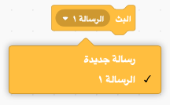
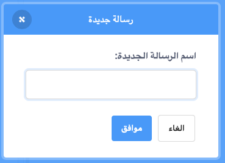
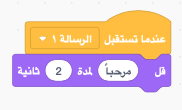

A broadcast is a way of sending a message from a sprite which can be heard by all sprites. Think of it like an announcement made over a loudspeaker.

### إرسال البث

يمكنك إرسال البث عن طريق إنشاء قالب بث وتحديد اسم لها:

+ Find the **broadcast** block under **Events**

+ Select **New Message** in the drop-down menu.

+ Then type your message

The message text can be anything you like, but it is useful to give the broadcast a sensible description. What happens when the message is received depends on the code you write.

### تلقى البث

الكائن يمكن أن يستجاب لبث بإستخدام هذا القالب البرامجي:

يمكنك إضافة قوالب برمجية أخرى أسفل هذا القالب البرمجي لتحدد للكائن ما يفعله عندما يتلقى إشارة البث.

