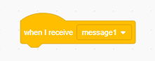

সম্প্রচার হ'ল একটি sprite থেকে বার্তা/message প্রেরণের একটি উপায় যা বাকি সমস্ত sprite শুনতে পায়।. এটিকে কোনও লাউড স্পিকারের মাধ্যমে ঘোষণার মতো মনে করুন।.

### একটি সম্প্রচার বার্তা বা broadcast পাঠান

আপনি একটি সম্প্রচারের ব্লক তৈরি করে তার মাধ্যমে বার্তা পাঠাতে পারেন এবং এটির একটি নাম দিতে পারেন:

+ **broadcast** ব্লকটি **Events** এর মধ্যে খুজুন

+ ড্রপ-ডাউন মেনুতে **New Message** সিলেক্ট।.

+ আপনার বার্তা বা message টি টাইপ করুন

বার্তাটি আপনার পছন্দ মতো যাকিছু হতে পারে তবে সম্প্রচার বা broadcast কে একটি বিচক্ষণ বর্ণনা দেওয়ার জন্য এটি দরকারী।. বার্তা বা message টি প্রাপ্ত হওয়ার পরে যা ঘটে তা আপনার লেখার কোডের উপর নির্ভর করে।.

### একটি সম্প্রচার বা broadcast গ্রহণ করুন

Sprite একটি সম্প্রচারে প্রতিক্রিয়া জানাতে পারে এই ব্লকটি ব্যবহার করে:

ব্রডকাস্ট সংকেত প্রাপ্ত হলে sprite কে কী করতে হবে তা বলার জন্য আপনি এই ব্লকের নীচে ব্লকগুলি যুক্ত করতে পারেন।.

