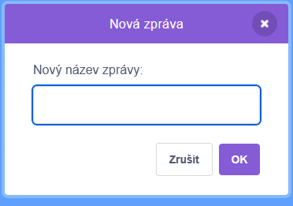

Pomocí bloku `vyšli zprávu`{:class="block3events"} odešleš zprávu, kterou uslyší všechny postavy. Můžeš si to představit jako hlášení z ampliónu.

**Vyslání kouzel**: Kouzelnou hůlkou klepni na tlačítka a vyšli kouzla. Co každé kouzlo udělá s postavami? [Podívej se sem](https://scratch.mit.edu/projects/518413238/editor){:target="_blank"}.

<div class="scratch-preview" style="margin-left: 15px;">
  <iframe allowtransparency="true" width="485" height="402" src="https://scratch.mit.edu/projects/embed/518413238/?autostart=false" frameborder="0"></iframe>
</div>

Můžeš vytvořit zprávu, která bude `vyslána`{:class="block3events"}. Text zprávy může být jakýkoli, ale bylo by vhodné, aby dával smysl.

+ V sekci `Události`{:class="block3events"} najdi blok `vyšli zprávu`{:class="block3events"}.

+ V rozbalovacím seznamu vyber možnost **Nová zpráva**.


+ Potom zadej svou zprávu.



### Vyšli zprávu

Můžeš se rozhodnout, kdy budeš chtít svou zprávu `vyslat`{:class="block3events"}. Například:

```blocks3
when this sprite clicked
broadcast (shrink v)
```

```blocks3
when backdrop switches to [level 1 v]
broadcast (start v)
```

### Přijmi zprávu

Postava může reagovat na `vyslanou zprávu`{:class="block3events"} pomocí bloku `po obdržení zprávy`{:class="block3events"}. Na stejnou zprávu může reagovat i více postav.

Pod blok `po obdržení zprávy`{:class="block3events"} můžeš přidat další bloky, které řeknou postavě nebo postavám, co mají dělat, když obdrží zprávu.

```blocks3
when I receive [shrink v]
change size by [-10] // negative numbers decrease the size
```

```blocks3
when I receive [start v]
go to x: (100) y: (50)
show
```