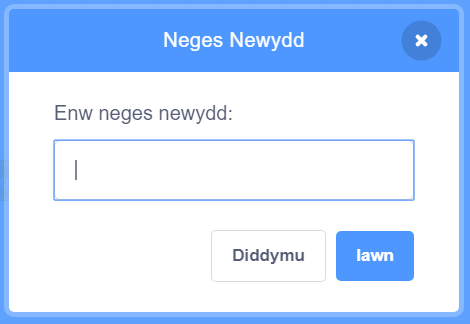

Mae darllediad yn ffordd o anfon neges gan un corlun y gellir ei chlywed gan yr holl gorluniau. Meddylia amdano fel cyhoeddiad dros uchelseinydd.

### Anfon darllediad

Gelli di anfon darllediad gan greu bloc darlledu a rhoi enw arno:

+ Tyrd o hyd i'r bloc **darlledu** yn yr adran **Digwyddiadau**

+ Dewisa **Neges Newydd** yn y gwymplen.

+ Yna teipia dy neges

Gall y testun fod yn unrhywbeth yr hoffet ti, ond mae'n ddefnyddiol i roi disgrifiad synhwyrol i'r darllediad. Mae'r hyn sy'n digwydd pan mae'r neges yn cael ei dderbyn yn dibynnu ar y côd rwyt ti'n ei ysgrifennu.

### Derbyn darllediad

Gall ciplun ymateb i ddarllediad gan ddefnyddio'r bloc hwn:

Gelli di ychwanegu blociau o dan y bloc hwn i ddweud wrth y corlun beth i'w wneud pan fydd yn derbyn y darllediad.

