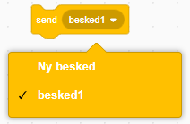
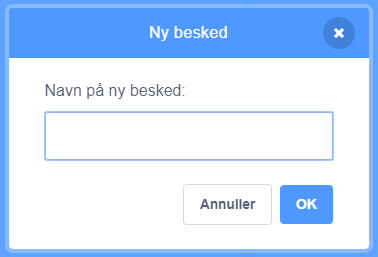
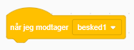
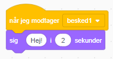

En hændelse er en måde, at sende en besked fra en sprite, som kan høres af alle sprites. Tænk på det som en meddelelse over en højttaler.

### Send en meddelelse

Du kan sende en meddelelse ved at oprette en send-blok og give den et navn:

+ Find **send** blokken under **Hændelser**

+ Vælg ** Ny besked ** i rullemenuen.

+ Skriv derefter din besked

Meddelelsesteksten kan være nøjagtig det, du synes, men det er nyttigt at give hændelsen en fornuftig beskrivelse. Hvad der sker, når meddelelsen modtages, afhænger af den kode, du skriver.

### Modtag en meddelelse

En sprite kan reagere på en meddelelse ved at bruge denne blok:

Du kan tilføje blokke under denne blok for at fortælle spriten, hvad den skal gøre, når den modtager meddelelsen.

