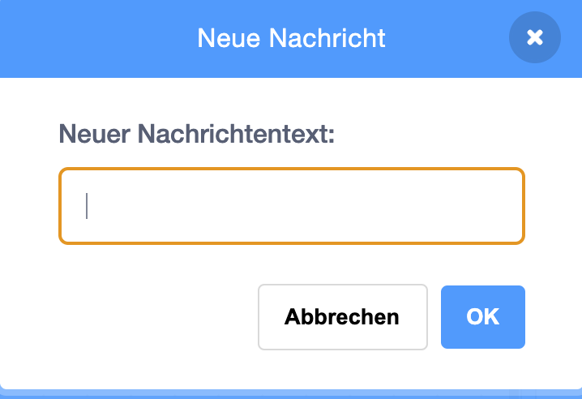

Mit einer Nachricht kannst du eine Mitteilung von einer Figur aussenden, die von allen anderen Figuren gehört werden kann. Stelle es dir wie eine Ansage über einen Lautsprecher vor.

### Eine Nachricht an alle senden

Du kannst eine Nachricht senden, indem du einen 'Sende Nachricht an alle'-Block erstellst und ihm einen Namen gibst:

+ Finde den **sende** Block unter **Ereignisse**

+ Wähle **Neue Nachricht** in der Auswahlbox aus.

+ Gebe dann deine Nachricht ein

Dein Nachrichtentext kann beliebig sein. Es hat sich jedoch als nützlich erwiesen, der Nachricht eine sinnvolle Beschreibung zu geben. Was passiert, wenn die Nachricht empfangen wird, hängt von dem Code ab, den du schreibst.

### Empfangen einer Sendung

Eine Figur kann mit diesem Block auf eine Sendung reagieren:

Du kannst Blöcke unterhalb dieses Blocks hinzufügen, um der Figur mitzuteilen, was zu tun ist, wenn sie die Sendung empfängt.

