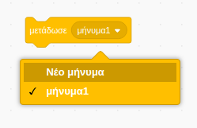
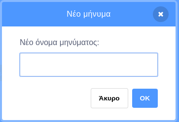
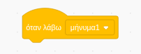
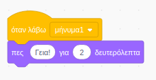

Η εκπομπή είναι ένας τρόπος να στείλεις ένα μήνυμα από ένα αντικείμενο (sprite) που μπορεί να ακουστεί από όλα τα άλλα αντικείμενα (sprites). Σκέψου το σαν μια ανακοίνωση από ένα μεγάφωνο.

### Εξέπεμψε ένα σήμα

Μπορείς να εκπέμψεις ένα σήμα δημιουργώντας ένα μπλοκ εκπομπής και δίνοντάς του ένα όνομα:

+ Βρες το μπλοκ **μετάδωσε** στα **Συμβάντα**

+ Επέλεξε **Νέο μήνυμα** στο αναπτυσσόμενο μενού.

+ Στη συνέχεια πληκτρολόγησε το μήνυμά σου

Το κείμενο του μηνύματος μπορεί να είναι οτιδήποτε, αλλά είναι χρήσιμο να δώσεις στην εκπομπή μια λογική περιγραφή. Αυτό που συμβαίνει όταν λαμβάνεται το μήνυμα εξαρτάται από τον κώδικα που γράφεις.

### Λήψη εκπεμπόμενου μηνύματος

Ένα αντικείμενο μπορεί να αντιδράσει σε μια εκπομπή μηνύματος χρησιμοποιώντας αυτό το μπλοκ:

Μπορείτε να προσθέσετε μπλοκ κάτω από αυτό το μπλοκ για να πείτε στο sprite τι πρέπει να κάνει όταν λάβει το σήμα εκπομπής.

