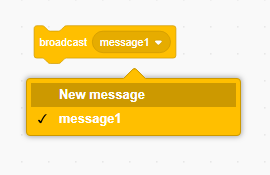

A `broadcast`{:class="block3events"} is a way of sending a message which can be heard by all sprites. Think of it like an announcement made over a loudspeaker.

<p style="border-left: solid; border-width:10px; border-color: #0faeb0; background-color: aliceblue; padding: 10px;">
<span style="color: #0faeb0">**Broadcasting messages**</span> is like shouting out a message to everyone in a game. In the game Marco Polo, one person closes their eyes and counts to ten then shouts 'Marco'. The other players then shout 'Polo' so the first player can use their listening skills to try and find them. 
</p>

You can create a message to be `broadcast`{:class="block3events"}. The message text can be anything you like, but it is useful to give it a sensible description.

+ Find the `broadcast`{:class="block3events"} block under `Events`{:class="block3events"}

+ Select **New Message** in the drop-down menu.



+ Then type your message


### Send a broadcast

You can decide when to `broadcast`{:class="block3events"} your message. For example:

```blocks3
when this sprite clicked
broadcast (shrink v)
```

```blocks3
when backdrop switches to [level 1 v]
broadcast (start v)
```

### Receive a broadcast

Sprite can react to a broadcast by using a `when I receive`{:class="block3events"} block. Multiple sprites can respond when they receive the same message.

You can add blocks below a `when I receive`{:class="block3events"} block to tell the sprite(s) what to do when they receives the message.

```blocks3
when I receive [shrink v]
change size by [-10] // negative numbers decrease the size
```

```blocks3
when I receive [start v]
go to x: (100) y: (50)
show
```
