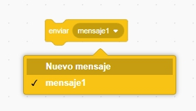
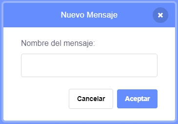
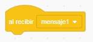
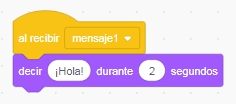

Una transmisión es una forma de enviar un mensaje desde un objeto para que pueda ser oído por todos los objetos. Piensa en ello como un anuncio hecho por un altavoz.

### Enviar una transmisión

Puedes enviar una transmisión creando un bloque de envío y dándole un nombre:

+ Encuentra el bloque **enviar** en la pestaña **Eventos**

+ Selecciona **Nuevo mensaje** en el menú desplegable.

+ Luego escribe tu mensaje

El texto del mensaje puede ser cualquier cosa, pero es útil que el texto de la transmisión sea descriptivo. Lo que suceda cuando el mensaje sea recibido depende del código que escribas.

### Recibir una transmisión

Un objeto puede reaccionar a una transmisión usando este bloque:

Puedes agregar bloques debajo de este bloque para decirle al objeto qué hacer cuando recibe el mensaje enviado.

