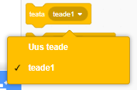
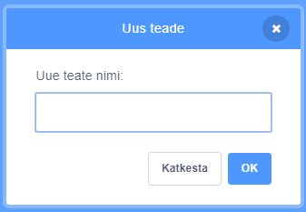
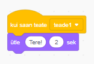

Saade on sõnumi saatmise viis spraidist, mida kuulevad kõik spraidid. Mõelge sellele nagu valjuhääldi kohta tehtud teadaanne.

### Saada saade

Saate saate saata, luues saateploki ja määrates sellele nime:

+ Leia **saade** plokk **Sündmuste** alt

+ Vali rippmenüüst **Uus Sõnum**.

+ Siis kirjuta oma sõnum

Sõnumi tekst võib olla mis iganes sulle meeldib, kuid on kasulik anda levitamisele loogiline kirjeldus. See, mis juhtub, kui sõnum vastu võetakse, sõltub kirjutatavast koodist.

### Võta saade vastu

Sprite saab saatele reageerida järgmise ploki abil:

Selle ploki alla saad lisada plokke, et öelda spraidile, mida teha, kui see võtab vastu saatesignaali.

