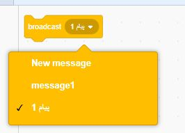
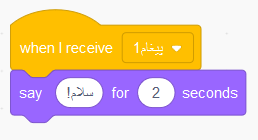

پخش سراسری یک راه برای ارسال یک پیام از یک شبح است که می‌تواند توسط تمام شبح‌ها شنیده شود. به آن مانند یک اعلانی که از بلندگو پخش می‌شود، فکر کنید.

### ارسال یک پخش سراسری

شما می‌توانید با ساخت یک بلوک پخش سراسری و نام‌گذاری آن، یک پخش سراسری را ارسال کنید:

+ بلوک **broadcast** را در قسمت **Events** پیدا کنید

+ در منوی کشویی **New Message** را انتخاب کنید.

+ سپس پیام خود را تایپ کنید

متن پیام می تواند هر چیزی باشد که دوست دارید، اما خوب است که یک توضیح معقول و مناسب را ارائه دهید. اتفاقی که هنگام دریافت پیام می‌افتد، به کدی که شما نوشته‌اید بستگی دارد.

### دریافت یک پخش سراسری

یک شبح می‌تواند با استفاده از این بلوک به یک پخش سراسری واکنش نشان دهد:

شما می‌توانید بلوک‌ها را به زیر این بلوک اضافه کنید تا به شبح بگویید که وقتی سیگنال پخش سراسری را دریافت می کند، چه کاری باید انجام دهد.

