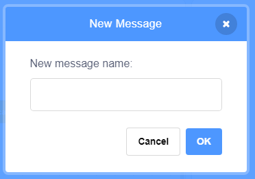

Ang broadcast ay isang paraan ng pagpapadala ng isang mensahe mula sa isang sprite na maaaring marinig ng lahat ng mga sprite. Isipin mo ito ng parang isang anunsyo na ginawa sa isang loudspeaker.

### Magpadala ng isang broadcast

Maaari kang magpadala ng isang broadcast sa pamamagitan ng paglikha ng isang broadcast block at pagbibigay nito ng isang pangalan:

+ Hanapin ang **broadcast** block sa ilalim ng **Events (Kaganapan)**

+ Piliin ang **New Message (Bagong Mensahe)** sa drop-down menu.

+ Pagkatapos ay i-type ang iyong mensahe

Ang message text ay maaaring maging kung anumang gusto mo, ngunit kapaki-pakinabang na bigyan ang broadcast ng isang makatwirang paglalarawan. Nakadepende sa sinulat mong code ang mangyayari sa natanggap na mensahe.

### Tumanggap ng isang broadcast

Ang sprite ay maaaring tumugon sa isang broadcast sa pamamagitan ng paggamit ng block na ito:

Maaari kang magdagdag ng mga blocks sa ibaba ng block na ito upang sabihin sa sprite kung ano ang gagawin kapag natanggap nito ang broadcast signal.

