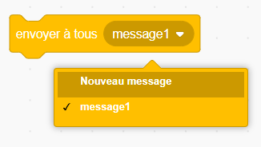
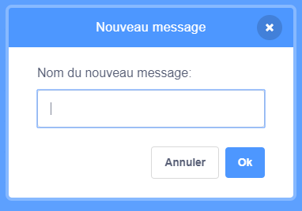
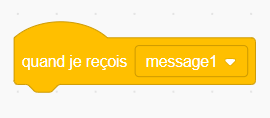
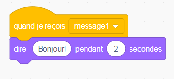

A broadcast is a way of sending a message from a sprite which can be heard by all sprites. Think of it like an announcement made over a loudspeaker.

### Envoyer un message à tous

Tu peux faire un envoi à tous en créant un bloc envoyer à tous et en lui attribuant un nom:

+ Find the **broadcast** block under **Events**

+ Select **New Message** in the drop-down menu.

+ Then type your message

The message text can be anything you like, but it is useful to give the broadcast a sensible description. What happens when the message is received depends on the code you write.

### Recevoir un message

Un lutin peut réagir à un envoi à tous en utilisant ce bloc:

Tu peux ajouter des blocs en dessous de celui-ci pour indiquer au lutin ce qu'il doit faire lorsqu'il reçoit un message envoyé à tous.

