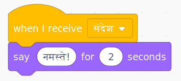

एक प्रसारण एक स्प्राइट से एक संदेश भेजने का एक तरीका है जिसे सभी स्प्राइट द्वारा सुना जा सकता है। इसे लाउडस्पीकर पर की गई घोषणा की तरह समझें।

### प्रसारण भेजें

आप एक प्रसारण(broadcast) ब्लॉक बनाकर और इसे एक नाम देकर प्रसारण भेज सकते हैं:

+ **प्रसारण(broadcast)** ब्लॉक को **ईवेंट(Event)** के तहत खोजें ।

+ ड्रॉप-डाउन मेनू में **नए संदेश(New Message)** का चयन करें ।

+ फिर अपना संदेश लिखें

संदेश पाठ कुछ भी आप चाहे वो हो सकता है, लेकिन प्रसारण को एक समझदार वर्णन देना उपयोगी है । संदेश प्राप्त होने पर क्या होता है वह आपके लिखित कोड पर निर्भर करता है ।

### प्रसारण प्राप्त करें

स्प्राइट इस ब्लॉक का उपयोग कर प्रसारण पर प्रतिक्रिया कर सकता है:

आप स्प्राइट को प्रसारण संदेश प्राप्त करने पर क्या करना है बताने के लिए इस ब्लॉक के नीचे ब्लॉक्स जोड़ सकते हैं।

