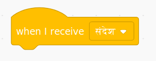

A broadcast is a way of sending a message from a sprite which can be heard by all sprites. Think of it like an announcement made over a loudspeaker.

### प्रसारण भेजें

You can send a broadcast by creating a broadcast block and giving it a name:

+ Find the **broadcast** block under **Events**

+ Select **New Message** in the drop-down menu.

+ Then type your message

The message text can be anything you like, but it is useful to give the broadcast a sensible description. What happens when the message is received depends on the code you write.

### प्रसारण प्राप्त करें

स्प्राइट इस ब्लॉक का उपयोग कर प्रसारण पर प्रतिक्रिया कर सकता है:

आप स्प्राइट को प्रसारण संदेश प्राप्त करने पर क्या करना है बताने के लिए इस ब्लॉक के नीचे ब्लॉक्स जोड़ सकते हैं।

