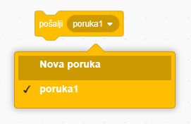
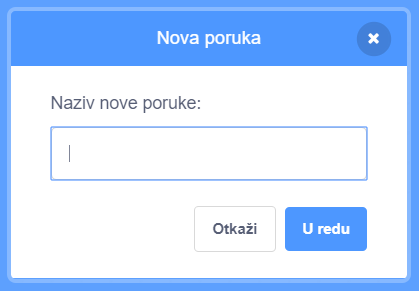
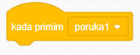
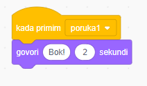

A broadcast is a way of sending a message from a sprite which can be heard by all sprites. Think of it like an announcement made over a loudspeaker.

### Pošalji poruku

Možeš poslati poruku tako da izradiš blok za emitiranje i daš mu ime:

+ Find the **broadcast** block under **Events**

+ Select **New Message** in the drop-down menu.

+ Then type your message

The message text can be anything you like, but it is useful to give the broadcast a sensible description. What happens when the message is received depends on the code you write.

### Primi poruku

Lik može reagirati na slanje poruke pomoću ovog bloka:

Možeš dodati blokove ispod ovog bloka kako bi odredio što lik treba učiniti kada primi poruku.

