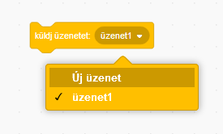
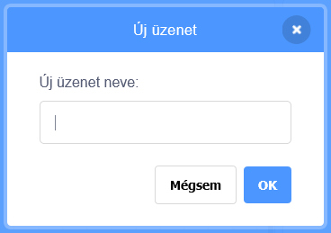
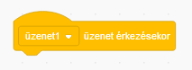
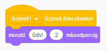

Az üzenetküldés egy olyan módszer, amellyel egy szereplő egy olyan üzenetet tud küldeni, amelyet minden szereplő meghallhat. Úgy gondolj rá, mint egy bejelentésre a hangosbemondón keresztül.

### Küldj egy üzenetet

Üzenet küldéséhez hozz létre egy üzenetküldő blokkot, és adj neki egy nevet:

+ Keresd meg a **küldj üzenetet** blokkot az **Események** lapon.

+ Válaszd ki az **Új üzenet** menüpontot a legördülő menüből.

+ Ezután írd be az üzenetet.

Az üzenet szövege bármi lehet, amit szeretnél, de hasznos, ha az üzenetnek értelmes a leírása. Az, hogy mi történik az üzenet fogadásakor, az általad írt kódtól függ.

### Üzenet fogadása

Egy szereplő az alábbi blokkal reagálhat az üzenetre:

A blokk alá hozzáadhatsz blokkokat, hogy megmondd a szereplőnek, mit kell tennie az üzenet fogadásakor.

