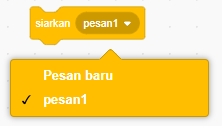
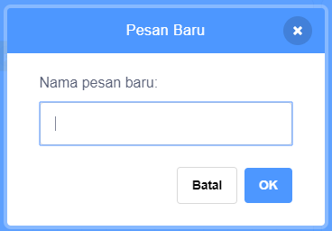
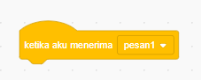
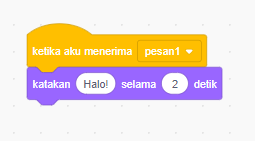

A broadcast is a way of sending a message from a sprite which can be heard by all sprites. Think of it like an announcement made over a loudspeaker.

### Kirim siaran

Kamu dapat mengirim siaran dengan membuat blok siaran dan memberinya sebuah nama:

+ Find the **broadcast** block under **Events**

+ Select **New Message** in the drop-down menu.

+ Then type your message

The message text can be anything you like, but it is useful to give the broadcast a sensible description. What happens when the message is received depends on the code you write.

### Terima siaran

Sprite dapat bereaksi terhadap siaran dengan menggunakan blok ini:

Kamu bisa menambahkan beberapa blok di bawah blok ini untuk memberi tahu sprite, apa yang harus dilakukan saat menerima sinyal siaran.

