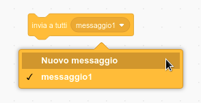
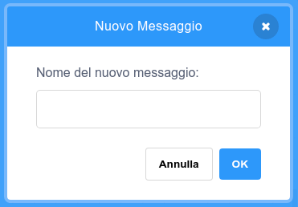
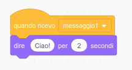

A broadcast is a way of sending a message from a sprite which can be heard by all sprites. Think of it like an announcement made over a loudspeaker.

### Inviare un messaggio

È possibile inviare un messaggio creando un blocco "invia a tutti" e assegnando un nome al messaggio:

+ Find the **broadcast** block under **Events**

+ Select **New Message** in the drop-down menu.

+ Then type your message

The message text can be anything you like, but it is useful to give the broadcast a sensible description. What happens when the message is received depends on the code you write.

### Ricevere un messaggio

Uno sprite può reagire ad un messaggio usando questo blocco:

È possibile aggiungere altri blocchi sotto questo blocco per dire allo sprite cosa fare quando riceve il messaggio trasmesso.

