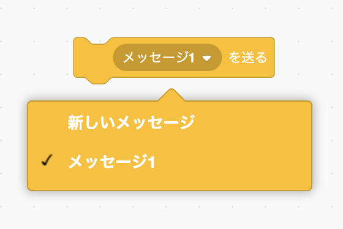
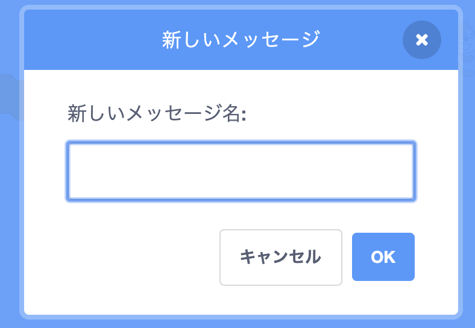
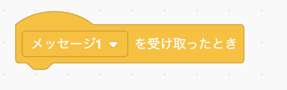
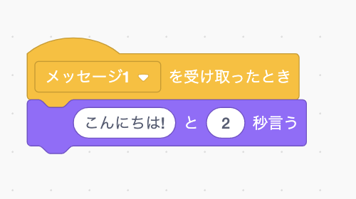

A broadcast is a way of sending a message from a sprite which can be heard by all sprites. Think of it like an announcement made over a loudspeaker.

### ブロードキャストを送る

You can send a broadcast by creating a broadcast block and giving it a name:

+ Find the **broadcast** block under **Events**

+ Select **New Message** in the drop-down menu.

+ Then type your message

The message text can be anything you like, but it is useful to give the broadcast a sensible description. What happens when the message is received depends on the code you write.

### ブロードキャストを受け取る

スプライトはこのブロックを使用してブロードキャストに反応することができます：

このブロックの下にブロックを追加して、スプライトがブロードキャスト信号を受け取ったときに何をすべきかを指示できます。

