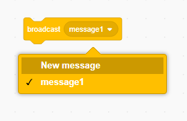

Broadcast (ಪ್ರಸಾರವು) ಸ್ಪ್ರೈಟ್‌ನಿಂದ ಸಂದೇಶವನ್ನು ಕಳುಹಿಸುವ ಒಂದು ಮಾರ್ಗವಾಗಿದೆ, ಅದನ್ನು ಎಲ್ಲಾ ಸ್ಪ್ರೈಟ್‌ಗಳು ಕೇಳಬಹುದು. ಧ್ವನಿವರ್ಧಕದ ಮೂಲಕ ಮಾಡಿದ ಪ್ರಕಟಣೆಯಂತೆ ಯೋಚಿಸಿ.

### ಪ್ರಸಾರವನ್ನು (Broadcast) ಕಳುಹಿಸಿ

Broadcast (ಪ್ರಸಾರ) ಬ್ಲಾಕ್ ಅನ್ನು ರಚಿಸುವ ಮೂಲಕ ಮತ್ತು ಅದಕ್ಕೆ ಹೆಸರನ್ನು ನೀಡುವ ಮೂಲಕ ನೀವು ಪ್ರಸಾರವನ್ನು ಕಳುಹಿಸಬಹುದು:

+ ಹುಡುಕಿ **broadcast** ಬ್ಲಾಕ್ **Events** ಅಡಿಯಲ್ಲಿ

+ ಆಯ್ಕೆಮಾಡಿ **New Message** ಡ್ರಾಪ್-ಡೌನ್ (menu) ಮೆನುವಿನಲ್ಲಿ.

+ ನಂತರ ನಿಮ್ಮ ಸಂದೇಶವನ್ನು ಟೈಪ್ ಮಾಡಿ

ಸಂದೇಶ ವಿಷಯ ನೀವು ಇಷ್ಟಪಡುವ ಯಾವುದಾದರೂ ಆಗಿರಬಹುದು, ಆದರೆ ಪ್ರಸಾರಕ್ಕೆ ಸರಿಯಾದ ವಿವರಣೆಯನ್ನು ನೀಡಲು ಇದು ಉಪಯುಕ್ತವಾಗಿದೆ. ಸಂದೇಶವನ್ನು ಸ್ವೀಕರಿಸಿದಾಗ ಏನಾಗುತ್ತದೆ ನೀವು ಬರೆಯುವ ಕೋಡ್ ಅನ್ನು ಅವಲಂಬಿಸಿರುತ್ತದೆ.

### Broadcast (ಪ್ರಸಾರವನ್ನು) ಸ್ವೀಕರಿಸಿ

ಈ ಬ್ಲಾಕ್ ಅನ್ನು ಬಳಸಿಕೊಂಡು ಸ್ಪ್ರೈಟ್ ಪ್ರಸಾರಕ್ಕೆ ಪ್ರತಿಕ್ರಿಯಿಸಬಹುದು:

Broadcast (ಪ್ರಸಾರ) ಸಂಕೇತವನ್ನು ಸ್ವೀಕರಿಸಿದಾಗ ಏನು ಮಾಡಬೇಕೆಂದು ಸ್ಪ್ರೈಟ್ಗೆ ಹೇಳಲು ನೀವು ಈ ಬ್ಲಾಕ್ನ ಕೆಳಗೆ ಬ್ಲಾಕ್ಗಳನ್ನು ಸೇರಿಸಬಹುದು.

