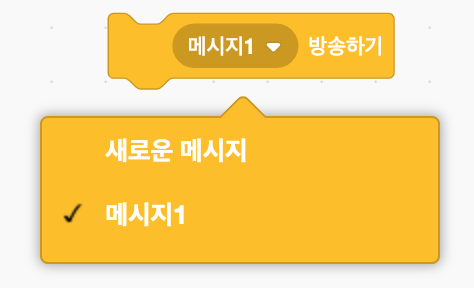
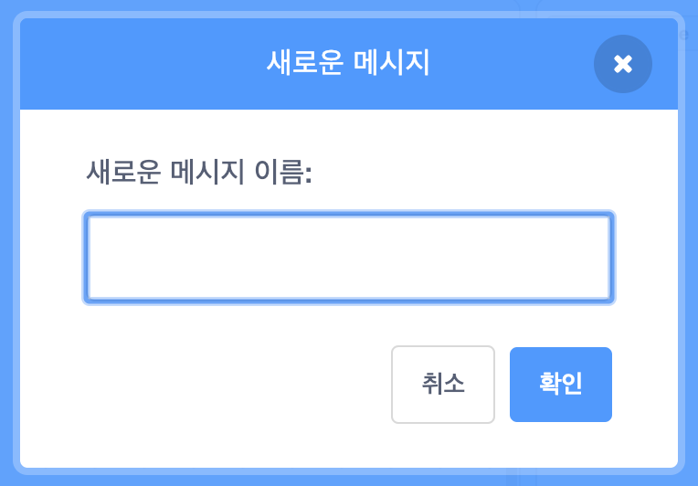
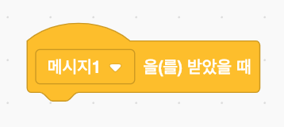
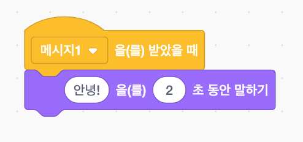

브로드캐스트는 모든 스프라이트 들을 수 있는 스프라이트에서 메시지를 보내는 방법입니다. 확성기를 통한 안내와 같이 생각하십시오.

### 브로드캐스트 전송

방송 블록을 만들고 메시지 이름을 지정하면 메시지를 방송할 수 있습니다:

+ **이벤트** 항목에서 **방송하기(브로드캐스트)** 블록을 찾으세요.

+ 메시지1 이라고 적혀 있는 드롭다운 메뉴를 클릭하여, **새로운 메시지**를 클릭합니다.

+ 메시지를 입력하세요.

메시지 텍스트는 자신이 원하는 문구를 적을 수 있으나, 어떤 용도로 쓰이는 메시지인지 명확하게 적는 것이 필요합니다. 메시지를 받을 때 어떤 일이 일어나는지는 작성한 코드에 따라서 달라집니다.

### 메시지 받기

스프라이트는 이 블록을 사용하여 방송된 메시지에 반응합니다.

아래에 블록을 추가하면, 스프라이트가 특정 메시지를 받았을 때 어떤 작업을 수행할지 지시할 수 있습니다.

