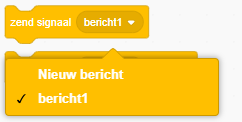
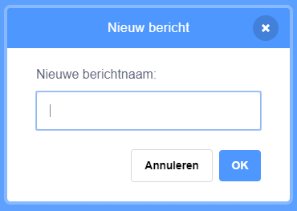
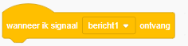
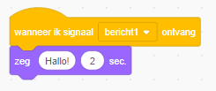

A broadcast is a way of sending a message from a sprite which can be heard by all sprites. Zie het als een aankondiging via een luidspreker.

### Verzend een signaal

Je kunt een signaal verzenden door een zend signaal blok te maken en het een naam te geven:

+ Zoek het **zend signaal** blok onder **Gebeurtenissen**

+ Selecteer **Nieuw bericht** in het vervolgkeuzemenu.

+ Typ vervolgens je bericht

The message text can be anything you like, but it is useful to give the broadcast a sensible description. Wat er gebeurt als het bericht wordt ontvangen, is afhankelijk van de code die jij schrijft.

### Ontvang een signaal

Een sprite kan reageren op een bericht door dit blok te gebruiken:

Je kunt blokken onder dit blok toevoegen om de sprite te vertellen wat hij moet doen als hij het bericht ontvangt.

