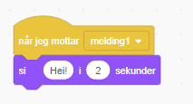

En melding er en måte å få en figur til å si noe som kan høres av alle andre figurer. Tenk på det som en kunngjøring gjort over en høyttaler.

### Send en melding

Du kan sende en melding ved å opprette en send melding-kloss og gi den et navn:

+ Finn **send melding**-klossen under **hendelser**

+ Velg **Ny melding** i rullegardinmenyen.

+ Skriv deretter inn meldingen din

Meldingen kan være hva som helst, men det er nyttig å gi den en fornuftig beskrivelse. Hva som skjer når meldingen mottas avhenger av koden du skriver.

### Motta en melding

En figur kan reagere på en melding ved å bruke denne klossen:

Du kan legge til klosser under denne klossen for å fortelle figuren hva den skal gjøre når den mottar meldingen.

