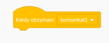
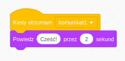

A broadcast is a way of sending a message from a sprite which can be heard by all sprites. Think of it like an announcement made over a loudspeaker.

### Nadaj komunikat

Możesz wysłać komunikat, tworząc blok nadawania komunikatu i nadając mu nazwę:

+ Find the **broadcast** block under **Events**

+ Select **New Message** in the drop-down menu.

+ Then type your message

The message text can be anything you like, but it is useful to give the broadcast a sensible description. What happens when the message is received depends on the code you write.

### Odbierz komunikat

Duszek może zareagować na komunikat za pomocą tego bloku:

Możesz dodać bloki poniżej tego bloku, aby powiedzieć duszkowi, co zrobić, gdy odbierze komunikat.

