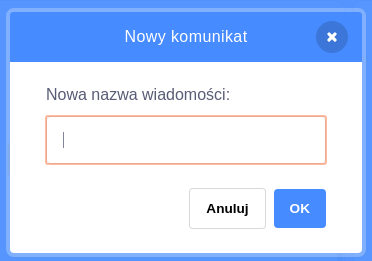

Nadawanie jest sposobem na wysłanie wiadomości przez duszka, który może być słyszany przez wszystkie duszki. Pomyśl o tym jak o komunikacie słyszanym z głośnika.

### Nadaj komunikat

Możesz wysłać komunikat, tworząc blok nadawania komunikatu i nadając mu nazwę:

+ Znajdź blok **Nadaj** w kategorii **Zdarzenia**

+ Wybierz opcję **Nowa wiadomość** w rozwijanym menu.

+ Następnie wpisz swoją wiadomość

Treść wiadomości może być dowolna, ale dobrze jest nadać komunikatowi sensowny opis. Co się stanie, gdy wiadomość zostanie odebrana, zależy od kodu, który napiszesz.

### Odbierz komunikat

Duszek może zareagować na komunikat za pomocą tego bloku:

Możesz dodać bloki poniżej tego bloku, aby powiedzieć duszkowi, co ma zrobić, gdy odbierze komunikat.

