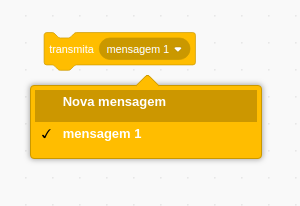
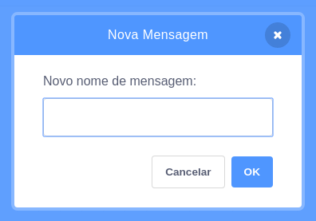
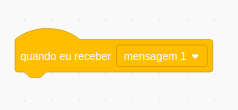
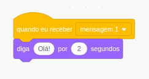

Uma transmissão é uma maneira de enviar uma mensagem de uma figura que pode ser ouvida por todas as outras figuras. Pense que é como um anúncio feito em um auto-falante.

### Enviar uma transmissão

Você pode enviar uma transmissão criando um bloco de transmissão e dando-lhe um nome:

+ Encontre o bloco **transmita** embaixo de **Eventos**

+ Selecione ** Nova mensagem ** no menu suspenso.

+ Em seguida, digite a sua mensagem

O texto da mensagem pode ser o que você quiser, mas é útil dar à transmissão uma descrição com sentido. O que acontece quando a mensagem é recebida depende do código que você escrever.

### Receba uma transmissão

Um ator pode reagir a uma transmissão usando este bloco:

Você pode adicionar blocos abaixo deste bloco para dizer ao ator o que fazer quando ele receber o sinal de transmissão.

