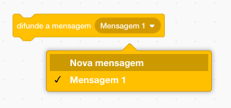
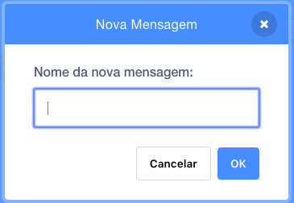
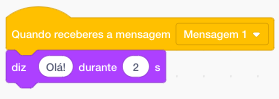

Uma difusão de mensagem é uma maneira de enviar uma mensagem de um actor que pode ser ouvida por todos os actores. Pensa que é como um anúncio feito num altifalante.

### Difundir uma mensagem

Podes difundir uma mensagem criando um bloco de difusão de mensagem e dando-lhe um nome:

+ Encontra o bloco **difunde uma mensagem** no separador **Eventos**

+ Seleciona **Nova mensagem** no menu suspenso.

+ Escreve a tua mensagem

O texto da mensagem pode ser o que quiseres, mas é útil dar à difusão uma descrição com sentido. O que acontece quando a mensagem é recebida depende do código que escreveres.

### Receber uma transmissão

Um actor pode reagir a uma transmissão usando este bloco:

Podes adicionar blocos abaixo deste bloco para dizer ao actor o que fazer quando receber o sinal de transmissão.

