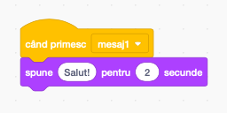

Transmiterea unui mesaj este o modalitate prin care un personaj poate fi auzit de toate celelalte personaje. Gândește-te exact ca la un anunț făcut la difuzor.

### Trimiterea unui mesaj

Poți trimite un mesaj adăugând un bloc „difuzează” și dându-i un nume:

+ Caută blocul **difuzează** în categoria **Evenimente**

+ Selectează **Mesaj nou** din listă.

+ Apoi scrie mesajul tău

Textul mesajului poate fi orice dorești, dar este bine să fie unul descriptiv. Ce se întâmplă când mesajul este recepționat, depinde de codul pe care l-ai scris.

### Recepționarea unei transmisiuni

Un personaj poate reacționa la o transmisiune folosind acest bloc:

Poți adăuga blocuri sub acest bloc pentru a spune personajului ce să facă atunci când primește mesajul transmis.

