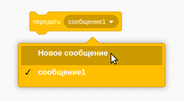
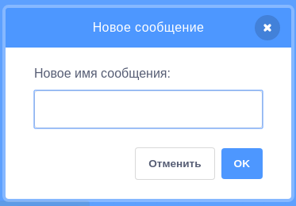
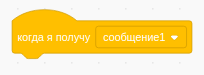
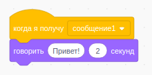

Передача (трансляция) сообщения — способ отправки сообщения спрайтом, которое может быть услышано другими спрайтами. Думай об этом как об уведомлении, сделанном через громкоговоритель.

### Передача сообщения

Ты можешь передать сообщение, создав блок передачи и присвоив ему имя:

+ Найди блок **передать** в **Событиях**

+ Выберите **Новое сообщение** в раскрывающемся меню.

+ Введи имя (текст) сообщения

Имя (текст) сообщения может быть любым, но удобно как-либо разумно описать сообщение в его имени. Что происходит при получении сообщения задаётся в коде, который ты напишешь.

### Получение сообщения

Спрайт может реагировать на сообщения с помощью этого блока:

Под этим блоком ты можешь добавить блок, который сообщит спрайту, что делать, когда он принимает сообщение.

