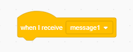

විකාශනය(broadcast) යනු එක් sprite එකකින් සෑම sprite එකකටම සවන් දිය හැකි ආකාරයෙන් පණිවිඩයක් යවන ක්‍රමයකි. එය ශබ්ද විකාශන යන්ත්‍රයක් හරහා කළ නිවේදනයක් මෙන් සිතන්න.

### විකාශනය කරන්න

විකාශන කට්ටියක්(broadcast block) නිර්මාණය කර එයට නමක් ලබා දීමෙන් විකාශනයක් කළ හැකිය:

+ **Events** යටතේ ඇති **විකාශන(broadcast)** කට්ටියක්(block) තෝරන්න.

+ පතන මෙනුවේ ඇති **නව පණිවිඩය(New Message)** තෝරන්න.

+ ඉන්පසු ඔබේ පණිවිඩය ටයිප් කරන්න

පණිවිඩ පෙළ ඔබ කැමති ඕනෑම දෙයක් විය හැකි නමුත් විකාශනය සඳහා නිවැරදි විස්තරයක් ලබා දීම ප්‍රයෝජනවත්වේ. පණිවිඩය ලැබුණු විට කුමක් සිදුවේද යන්න ඔබ ලියන කේතය(code) මත රඳා පවතී.

### විකාශනය ලබාගන්න

මෙම කට්ටිය(block) භාවිතා කිරීමෙන් sprite එක විකාශනයකට ප්‍රතික්‍රියා කරයි:

මෙම කට්ටියට(block) පහළින් තවත් කට්ටි(blocks) එක්කරගත හැක, එමගින් sprite එකකට විකාශන පනිවිඩයක් ලැබුණු විට කුමක් කළ යුතු දැයි කියවේ.

