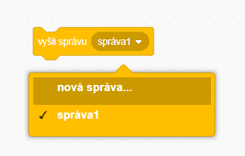
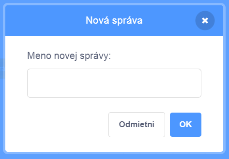
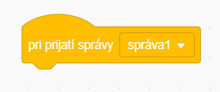
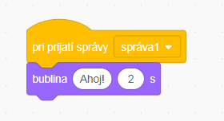

Vysielanie je spôsob, akým postava pošle správu, ktorú môžu počuť všetky ostatné postavy. Premýšľajte o tom ako o oznámení cez reproduktor.

### Odoslať vysielanie

Vysielanie môžete odoslať vytvorením rozhlasového bloku a jeho názvom:

+ Nájdite blok **Vyšli správu** v časti **Udalosti**

+ Z možností ponuky vyberte položku **Nová správa**.

+ Potom zadajte svoju správu

Text správy môže byť čokoľvek, čo sa vám páči, ale je užitočné dať vysielaniu rozumný popis. Čo sa stane po prijatí správy, závisí od kódu, ktorý ste napísali.

### Prijatie vysielania

Postava môže reagovať na vysielanie pomocou tohto bloku:

Pod týmto blokom môžete pridať ďalšie bloky, aby ste povedali, čo sa má diať, keď sa vysielaný signál prijme.

