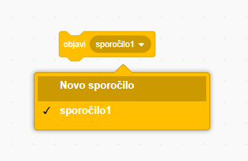
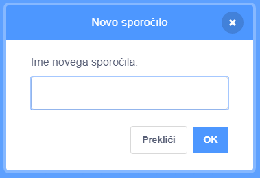
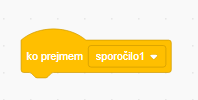
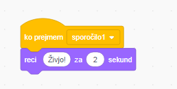

Objava je način, na katerega figura pošlje sporočilo, ki ga lahko slišijo vse figure. Razmišljaj o njej, kot da bi šlo za objavo preko zvočnika.

### Pošlji objavo

Objavo lahko pošlješ tako, da ustvariš blok "objavi" in jo poimenuješ:

+ Poišči blok **"objavi"** med **Dogodki**

+ V spustnem meniju izberi **Novo sporočilo**.

+ Nato vnesi svoje sporočilo

Besedilo sporočila je lahko karkoli, vendar je za uporabnost pomembno, da ima objava smiseln opis. Kaj se zgodi po prejemu sporočila je odvisno od kode, ki jo napišete.

### Sprejem objave

Figura se lahko odzove na objavo z uporabo tega bloka:

Pod tem blokom lahko dodaš bloke, ki povedo figuri, kaj naj stori, ko prejme neko objavo.

