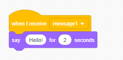

ஓர் ஒலிபரப்பு(broadcast/வலைப்பரப்பு) என்பது ஒரு Sprite-இன் ஒரு செய்தியை, மற்ற அனைத்து sprite-களும் கேட்கும்படி அனுப்புவதற்கான ஒரு வழியாகும். ஓர் ஒலிபெருக்கி மூலம் வெளியிடப்பட்ட ஓர் அறிவிப்பைப் போல நினைத்துப் பாருங்கள்.

### ஓர் ஒலிபரப்பை அனுப்பவும்

ஓர் ஒலிபரப்புத் தொகுதியை உருவாக்கி, அதற்கு ஒரு பெயரைக் கொடுப்பதன் மூலம் ஓர் ஒலிபரப்பை நீங்கள் அனுப்பலாம்:

+ **Events**-இன் கீழே உள்ள **broadcast** தொகுதியைக் (block) கண்டறியவும்

+ கீழ்விரி பட்டியில் (drop-down menu) உள்ள **New Message** -ஐத்(புதிய செய்தி) தேர்ந்தெடுக்கவும்.

+ பின்னர், உங்கள் செய்தியைத் தட்டச்சு செய்க

செய்தி உரை நீங்கள் விரும்பும் எதையும் கொண்டிருக்கலாம். ஆனால் ஒலிபரப்பிற்கு, ஓர் விவேகமான விளக்கத்தை வழங்குவதாக இருந்தால் அது பயனுள்ளதாக இருக்கும். செய்தியைப் பெறுபோது என்ன நடக்கும் என்பது நீங்கள் எழுதும் குறியீட்டைப்(code) பொறுத்தது.

### ஓர் ஒலிபரப்பைப் பெறுக

இந்த தொகுதியைப் பயன்படுத்தி, ஒரு sprite ஒலிபரப்பிற்கான எதிர்வினையை செய்யலாம்:

இந்த தொகுதிக்குக் கீழே மேலும் சில தொகுதிகளை நீங்கள் சேர்க்கலாம். இதன் மூலம் ஒலிபரப்புக் குறிகையைப்(signal) பெறும்போது, sprite என்ன செய்ய வேண்டும் என்பதை அதற்குக் கூறலாம்.

