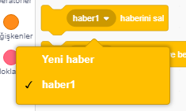
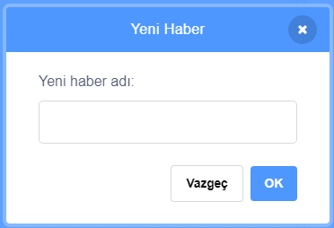
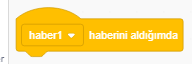
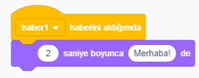

Haber; bir kukla mesajının, tüm kuklalar tarafından duyulmasını sağlayan mesaj gönderme yoludur. Bunu hoparlör üzerinden yapılan bir duyuru gibi düşünün.

### Bir haber gönderme

Bir haberi; haber bloğu oluşturup ve ona bir isim vererek gönderebilirsiniz:

+ **Olaylar** sekmesinden **haber** 'i bulun

+ Açılır menüden **Yeni haber** 'i seçin.

+ Sonra mesajınızı yazın

Mesaj metni dilediğiniz herhangi bir şey olabilir, ancak habere mantıklı bir açıklama vermek faydalıdır. Mesaj alındığında ne olacağı yazdığınız koda bağlıdır.

### Bir haber almak

Bir kukla, bu bloğu kullanarak bir habere tepki verebilir:

Kuklaya, haber sinyalini aldığında ne yapacağını söylemek için bu bloğun altına başka bloklar ekleyebilirsiniz.

