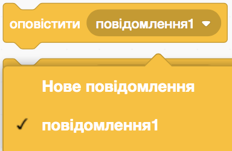
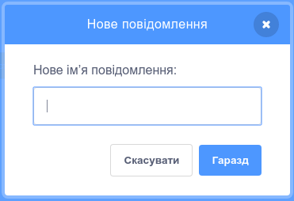

`Оповіщення`{:class="block3events"} - це спосіб передачі повідомлення, яке можуть почути всі спрайти. Уявляй, що це оголошення, зроблене через гучномовець.

**Заклинання Оповіщування**: За допомогою чарівної палички натискай на кнопки та вимовляй заклинання. Що кожне заклинання робить із персонажами? [Переглянути код](https://scratch.mit.edu/projects/752264639/editor){:target="_blank"}

<div class="scratch-preview" style="margin-left: 15px;">
  <iframe allowtransparency="true" width="485" height="402" src="https://scratch.mit.edu/projects/embed/752264639/?autostart=false" frameborder="0"></iframe>
</div>

Ти можеш створити повідомлення, яке зможе `оповістити`{:class="block3events"}. Текст повідомлення може бути будь-яким, але бажано дати йому розумний опис.

+ Знайди блок `оповістити`{:class="block3events"} у меню блоків `Події`{:class="block3events"}

+ Вибери **Нове повідомлення** у меню що випадає.



+ Далі введи своє повідомлення



### Відправлення оповіщень

Ти можеш вирішити, коли `оповіщувати`{:class="block3events"} твоє повідомлення. Наприклад:

```blocks3
when this sprite clicked
broadcast (зменшувати v)
```

```blocks3
when backdrop switches to [рівень 1 v]
broadcast (старт v)
```

### Отримання оповіщень

Спрайт може відреагувати на `оповіщення`{:class="block3events"} за допомогою блока `коли я отримую`{:class="block3events"}. Декілька спрайтів можуть відреагувати на одне і те ж повідомлення.

Ти можеш додавати блоки під ним, щоб сказати спрайту що він має робити, коли отримає оповіщення.

```blocks3
when I receive [зменшувати v]
change size by [-10] // негативні числа зменшують розмір
```

```blocks3
when I receive [старт v]
go to x: (100) y: (50)
show
```
