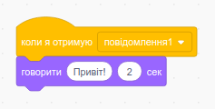

Оповіщення — це спосіб надсилання повідомлення від одного спрайта іншим. Це, як оголошення, яке озвучене у гучномовець.

### Відправлення оповіщень

Ти можеш відправити повідомлення, створивши блок "оповістити" і надавши йому ім'я:

+ Знайди блок **оповістити** в **Події**

+ Вибери **Нове повідомлення** у меню що випадає.

+ Далі введи своє повідомлення

Текст повідомлення може бути будь-яким, але важливо дати оповіщенню розумний опис. Що трапиться після отримання цього повідомлення, залежить від коду, який ти напишеш.

### Отримання оповіщення

Спрайт може реагувати на оповіщення за допомогою цього блоку:

Ви можете додати блоки нижче цього блоку, щоб сказати спрайту що він має робити, коли він отримує повідомлення.

