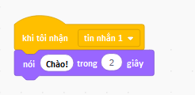

Phát sóng là một cách để gửi một tin nhắn từ một đối tượng- đồ hoạ máy tính- có thể được nghe bởi tất cả các đối tượng khác. Hãy nghĩ về nó giống như một thông báo được thực hiện qua loa.

### Gửi một tin

Bạn có thể gửi một tin bằng cách tạo một khối phát sóng và đặt tên cho nó:

+ Tìm khối **phát sóng ** dưới **Sự kiện**

+ Chọn **Tin nhắn mới** trong menu thả xuống.

+ Sau đó nhập tin nhắn của bạn

Nội dung tin nhắn có thể là bất cứ điều gì bạn thích, nhưng cung cấp cho các phát sóng một mô tả hợp lý sẽ hữu ích. Điều gì sẽ xảy ra khi nhận được tin nhắn phụ thuộc vào mã bạn viết.

### Nhận một chương trình phát sóng

Một sprite có thể phản ứng với một phát sóng bằng cách sử dụng khối này:

Bạn có thể thêm các khối bên dưới khối này để báo cho sprite biết phải làm gì khi nhận được tín hiệu phát sóng.

