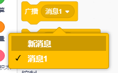
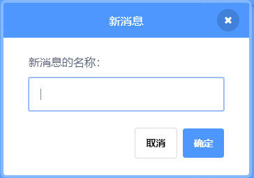

A broadcast is a way of sending a message from a sprite which can be heard by all sprites. Think of it like an announcement made over a loudspeaker.

### 发送广播

You can send a broadcast by creating a broadcast block and giving it a name:

+ Find the **broadcast** block under **Events**

+ Select **New Message** in the drop-down menu.

+ Then type your message

The message text can be anything you like, but it is useful to give the broadcast a sensible description. What happens when the message is received depends on the code you write.

### 接收广播

角色可以使用这个块对广播做出反应:

可以在这个块下面加入块，告诉角色当它收到广播信号时要做些什么。

