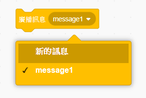
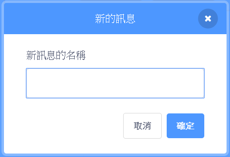
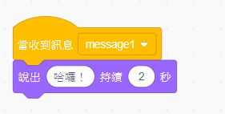

廣播訊息是角色發出訊息的一種方式，所有角色都收得到。 你可以把它想成像是利用擴音器發表聲明。

### 發送廣播訊息

你可以建立一個廣播訊息積木並為其命名以發送廣播訊息：

+ 在**事件**欄位中找出**廣播訊息**積木

+ 在下拉式選單中選擇**新的訊息**

+ 接著輸入你的訊息

訊息的文字可以任意撰寫，但是如果能對廣播的內容提供一個合理敘述的話，會變得非常有用。 收到訊息時會發生什麼事情取決於您撰寫的程式碼。

### 接收廣播訊息

角色可以使用此積木對廣播做出反應：

您可以在這個積木下方添加其他積木，以告訴角色在收到廣播時要採取什麼行動。

